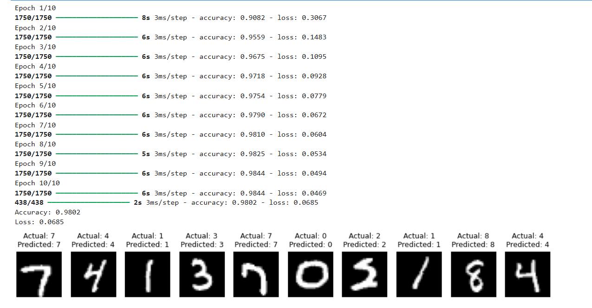

# MNIST Handwritten Digit Classifier

[](https://www.python.org/)
[](https://www.tensorflow.org/)
[](LICENSE)

A simple Artificial Neural Network (ANN) built using TensorFlow and Keras to classify handwritten digits (0–9) from the MNIST dataset.

---

## Overview

This project demonstrates the implementation of a feedforward neural network for handwritten digit recognition. It includes data preprocessing, model training, evaluation, and visualization of predictions.

### Features

- Handwritten digit recognition (0–9)
- TensorFlow/Keras Sequential API
- Data preprocessing and normalization
- One-hot encoding of labels
- Train/Test split using Scikit-learn
- Dropout regularization to reduce overfitting
- Displays Actual vs Predicted labels
- Accuracy and Loss evaluation

---

## Tech Stack

- Python
- TensorFlow
- Keras
- NumPy
- Pandas
- Matplotlib
- Scikit-learn

---

## Dataset

The project uses the **MNIST Handwritten Digit Dataset**.

Dataset Details:

- 70,000 handwritten digit images
- Image Size: **28 × 28**
- 784 pixel values per image
- 10 output classes (Digits 0–9)

The dataset is included in this repository and is managed using Git Large File Storage (Git LFS)

```
mnist.xls
```

---

## Model Architecture

```
Input Layer (784)

        ↓

Dense Layer (128, ReLU)

        ↓

Dropout (0.2)

        ↓

Output Layer (10, Softmax)
```

### Architecture Explanation

- **Input Layer:** 784 neurons (28×28 flattened image)
- **Dense Layer:** 128 neurons with ReLU activation
- **Dropout Layer:** 20% dropout to reduce overfitting
- **Output Layer:** 10 neurons with Softmax activation

---

## Installation

Clone the repository:

```bash
git clone https://github.com/DaleG16/MNIST-digit-classification-neural-network.git
```

Move into the project folder:

```bash
cd MNIST-digit-classification-neural-network
```

Install dependencies:

```bash
pip install -r requirements.txt
```

---

## Usage

Run the program using:

```bash
python mnist_classifier.py
```

The program will:

- Load the MNIST dataset
- Preprocess the data
- Train the neural network
- Evaluate the model
- Display Accuracy and Loss
- Visualize sample predictions with Actual and Predicted labels

---

## Output



---

## Project Structure

```
MNIST-digit-classification-neural-network/

├── .gitattributes
├── LICENSE
├── mnist.xls
├── mnist_classifier.py
├── output.png
├──README.md
└── requirements.txt
```

---

## What I Learned

Through this project I learned:

1. **Neural Network Basics**: Layers, activations, backpropagation
2. **Data Preprocessing**: Normalization, one-hot encoding, train/test split
3. **Regularization**: Dropout to prevent overfitting
4. **Model Evaluation**: Accuracy, loss, visualization of predictions
5. **TensorFlow/Keras API**: Sequential models, layer definitions, compilation
   
---

## License

This project is licensed under the **MIT License** - see the [LICENSE](LICENSE) file for details.

---

## Author

**Dale Chris** <br>
Artificial Intelligence & Machine Learning Engineering Student
